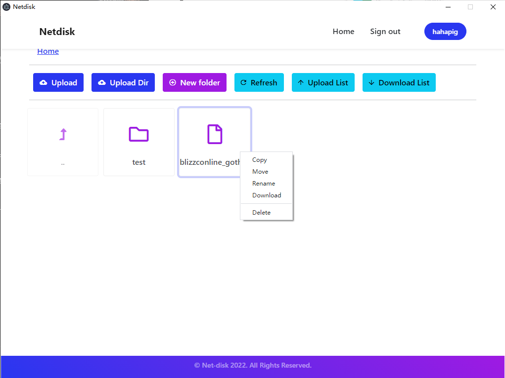

# Netdisk


## Introductions

This project is a netdisk system with breakpoint upload, Multi-user upload, breakpoint download, etc., and supports synchronization of data between desktop and web side.

This project uses C++ and Mysql for the backend, PHP for the server and Electron for the client.



## Deploy

This project uses httpd, PHP, node.js and npm. Go check them out if you don't have them locally installed.

### Deploy MySQL

Please install MariaDB before.

```sh
mysql -u root -proot123 < db.sql
```

### Deploy Server

Please install the C++ environment before.

```sh
cd netdisk_server
make
echo "#!/bin/sh" > netdiskstart.sh
echo "#chkconfig: 2345 80 90" >> netdiskstart.sh
echo "description:auto_run" >> netdiskstart.sh
echo "cd `pwd` && make run" >> netdiskstart.sh
chmod 755 netdiskstart.sh
mkdir -p /etc/init.d/
cp netdiskstart.sh /etc/init.d/
chkconfig --add /etc/init.d/netdiskstart.sh
```

### Deploy Web

```sh
cp ./web2 /var/www/
cd /var/www/
mkdir -p upload
chmod 777 /var/www/upload
cd $curpath
```

## Run

### Run Server

Open the root directory of the external IP directly.

Run the command `make run` in the unpacked directory on the server side (by default, it is in the install directory of the original directory) to start running the server side. The console will show the log file name of this run, which is in the same directory.
If you have changed the database account, password, database name, etc., you can change the . /test_socket program and add `--user xxx --passwd xxx --database xxx` to the run parameters. Change xxx as needed.

To stop the server side, run the command `make stop` in the unpacked directory on the server side.

To delete unnecessary saved files, you can run `make delete` in the unpacked directory on the server side.
Note that the successful run of make delete requires that the `SLICES_DIR` value of the delete entry in the makefile be manually changed to the actual storage address.

For the server-side self-start, the configuration of the self-start operation is already included in the general installation script install.sh.

The netdiskstart.sh script file in the /etc/init.d/ directory is automatically generated

```!
description:auto_run
cd /root/Netdisk/install/netdisk_server && touch 1.txt && make run
```
Note that the run directory is the install directory in your unpacked directory. If you want to move the server to another location, change the cd directory in the fourth line of the script accordingly. (Note that the first three lines of the script are required)

If the self-start configuration fails, you can try to configure it manually.
Run the command `chmod 755 netdiskstart.sh` and set the script to be executable by all users and modifiable only by the root user. (netdiskstart.sh should be prefixed with the directory where the script file is located as needed)

Run the command `chkconfig --add /etc/init.d/netdiskstart.sh` to add the script to the self-starting service.

### Run Client

Go to the client directory of the source code (i.e. the directory where main.js is located), type `npm install` and enter, wait for it to be installed and then type `npm start` to run it.

If you need to export the executable, just type `npm run packager` and wait for a while, you will see the exported executable in the app directory, just double-click it to run it.

## License

[MIT](https://opensource.org/licenses/MIT)

Copyright (c) 2022-present
